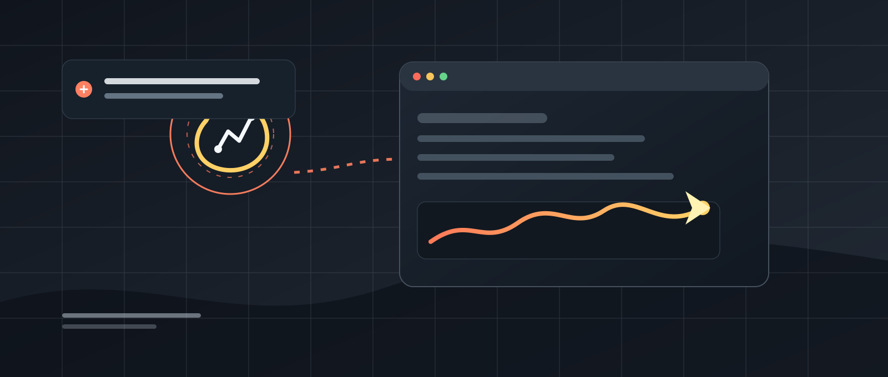
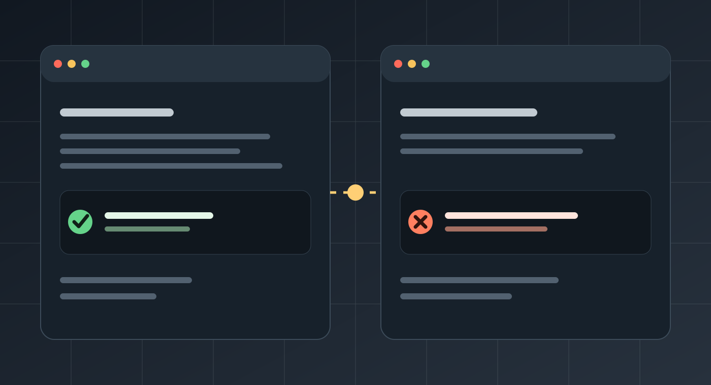
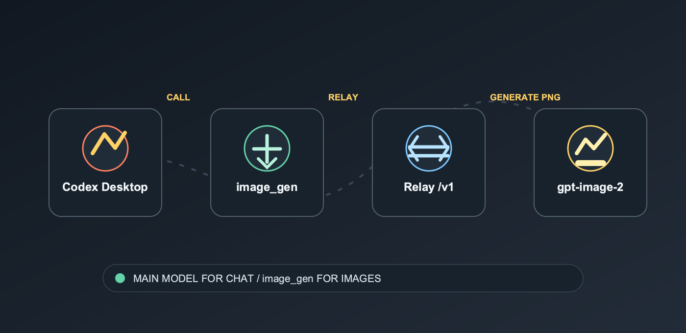

# 别再折腾 API Key 了：Codex Desktop 图片生成失败，可能只是少了这一步

> 文字对话能用，代码生成正常，唯独 `image_gen` 调不起来？
> 这可能不是模型问题，也不一定是 API Key 失效，而是 Codex Desktop 的图片工具没有正确继承你的中转配置。



很多人在 Codex Desktop 里配置了自定义 OpenAI 兼容中转。

聊天可以正常进行，代码可以正常生成，甚至 `/v1/responses` 也能返回结果。

但一到图片生成，就出现各种问题：

- 看不到 `image_gen` 工具；
- 调用图片时提示鉴权失败；
- 明明已经配置了 API Key，Codex 还是说没有权限；
- 终端里测试正常，桌面版 Codex 却无法生成图片；
- 图片模型明明存在，但 Codex 就是不调用。

这到底是怎么回事？

最近发现了一个专门解决这个问题的开源项目：

**codex-imagegen-relay-fix**

它现在同时提供 macOS 和 Windows 的修复脚本，针对 Codex Desktop 的自定义 provider 场景，修复图片生成工具无法通过中转调用的问题。

## 文字能用，为什么图片不能用？

这是很多人第一次遇到时最困惑的地方。

通常情况下，你在 Codex 中使用的是一个支持工具调用的对话模型，例如：

```text
gpt-5.4
```

当你要求 Codex 生成图片时，它并不是简单地把当前模型切换成图片模型。

真正的调用链路更接近这样：

```text
Codex 对话模型
       ↓
判断需要生成图片
       ↓
调用内置 image_gen 工具
       ↓
访问 gpt-image-2
       ↓
返回本地 PNG 图片
```



也就是说，聊天模型和图片生成工具虽然都在 Codex 里，但它们可能涉及不同的配置、环境变量和鉴权逻辑。

只要其中一环没有配置好，就会出现：

> **文字请求正常，图片请求失败。**

这也是为什么很多人反复更换 API Key，最后还是没有解决问题。

## 真正的问题，往往不是 API Key

根据项目 README，常见问题主要集中在以下几个地方。

### 1. 自定义 provider 仍然要求官方鉴权

配置中如果还保留：

```toml
requires_openai_auth = true
```

Codex 可能会继续按照官方 provider 的方式处理鉴权。

但你使用的是自定义中转，鉴权方式可能完全不同。

### 2. API Key 被直接写进了配置文件

一些人会把 API Key 直接写进 `config.toml`。

这样做存在两个问题：

- 容易泄露；
- 可能和 Codex 原有的认证方式冲突。

更合理的配置方式是让 provider 从环境变量读取：

```toml
env_key = "OPENAI_API_KEY"
```

而不是把完整 API Key 静态写在配置文件里。

### 3. 旧的认证方式没有清理

如果配置中同时存在：

```toml
auth = { command = "..." }
```

或者其他 bearer token、Node helper 配置，就可能出现多个认证来源互相覆盖。

脚本会清理当前 provider 中可能冲突的认证配置，让 Codex 统一从 `OPENAI_API_KEY` 环境变量读取密钥。

### 4. 终端有环境变量，桌面应用却没有

这才是 macOS 用户最容易忽略的一点。

你在终端里执行：

```bash
export OPENAI_API_KEY="..."
```

并不代表从 Finder、Launchpad 启动的 Codex Desktop 也可以读取到这个变量。

于是就出现了一个非常奇怪的现象：

```text
终端测试：正常
Codex Desktop：失败
```

### 5. 图片生成功能没有打开

Codex 配置中还需要启用：

```toml
[features]
image_generation = true
```

如果这个功能开关缺失，或者配置文件中出现重复的 `[features]` 区块，也可能导致图片工具没有正常加载。

### 6. 中转地址缺少 `/v1`

如果中转地址只写到域名：

```text
https://relay.example.com
```

但实际接口要求：

```text
https://relay.example.com/v1
```

那么 `/v1/models` 或 `/v1/responses` 的请求就可能无法正常访问。

## 这个开源项目到底做了什么？

这个项目不是重新写一个图片生成客户端，也不是通过 MCP 额外包装一个图片工具。

它做的事情非常直接：

> **修正 Codex 的 provider 配置，让桌面版 Codex 能够正确继承图片生成所需要的环境变量。**



整个过程主要分为四步。

### 第一步：读取已有的 API Key

脚本会从以下位置查找已有的认证信息：

```text
$CODEX_HOME/auth.json
```

或者：

```text
~/.codex/auth.json
```

读取过程中，脚本不会把完整 API Key 打印到终端，也不会把密钥写入仓库、日志或 LaunchAgent 配置文件。

它只会告诉你：

```text
OPENAI_API_KEY(auth.json)=EXISTS
```

或者：

```text
OPENAI_API_KEY(auth.json)=MISSING
```

### 第二步：修复 provider 配置

配置会被调整为类似这样：

```toml
[model_providers.custom]
name = "custom"
base_url = "https://relay.example.com/v1"
wire_api = "responses"
requires_openai_auth = false
env_key = "OPENAI_API_KEY"

[features]
image_generation = true
```

这里有几个重点：

- 使用 Responses API；
- 关闭官方 provider 鉴权要求；
- 从环境变量读取 API Key；
- 打开图片生成功能；
- 确保中转地址包含 `/v1`。

### 第三步：让桌面应用继承环境变量

macOS 为了让 Codex Desktop 也能读取环境变量，脚本会安装 LaunchAgent。

涉及的文件包括：

```text
~/.codex/bin/codex-imagegen-env.sh
~/Library/LaunchAgents/com.maynor.codex-imagegen-env.plist
```

它的作用是：

```text
macOS 用户登录
       ↓
加载 OPENAI_API_KEY
       ↓
桌面应用继承环境变量
       ↓
Codex Desktop 调用 image_gen
```

Windows 不使用 LaunchAgent，而是把 `OPENAI_API_KEY` 写入当前用户环境变量：

```text
PowerShell 脚本
       ↓
写入 Windows User 环境变量
       ↓
完全重启 Codex Desktop
       ↓
新进程继承 OPENAI_API_KEY
```

Windows 用户在 PowerShell 中运行：

```powershell
cd codex-imagegen-relay-fix
Set-ExecutionPolicy -Scope Process -ExecutionPolicy Bypass
.\fix-codex-imagegen-windows.ps1
```

中转地址不同可以这样指定：

```powershell
.\fix-codex-imagegen-windows.ps1 -RelayBaseUrl 'https://relay.example.com/v1'
```

脚本读取 `%CODEX_HOME%\\auth.json` 或 `%USERPROFILE%\\.codex\\auth.json`，不会打印完整 Key。执行结束后要关闭所有 Codex 窗口和后台进程，再从开始菜单重新启动并新建任务。

### 第四步：自动验证中转接口

脚本不会只修改完配置，然后告诉你“已经完成”。

它还会主动检查：

- Codex 原生二进制是否存在；
- `/v1/models` 是否可以访问；
- `/v1/responses` 是否可以访问；
- `gpt-image-2` 是否可用；
- 对话模型是否可用；
- 图片生成功能是否已打开。

正常情况下，你可能会看到类似结果：

```text
provider_config=OK
models_http=200
gpt-image-2=AVAILABLE
gpt-5.4=AVAILABLE
responses_http=200
image_generation_config=READY
```

## 怎么使用？

macOS 用户下载项目后，进入项目目录：

```bash
cd codex-imagegen-relay-fix
```

给脚本增加执行权限：

```bash
chmod 700 fix-codex-imagegen-macos.sh
```

然后运行：

```bash
./fix-codex-imagegen-macos.sh
```

如果你使用的是其他兼容中转，可以通过环境变量指定地址：

```bash
CODEX_RELAY_BASE_URL='https://relay.example.com/v1' \\
./fix-codex-imagegen-macos.sh
```

Windows 用户使用上面的 PowerShell 命令，不要直接运行 `.sh` 文件。

运行前，建议先检查脚本中的默认配置，确认：

- 中转地址是否可信；
- 是否符合自己的账户权限；
- 是否支持 `/v1/models`；
- 是否支持 `/v1/responses`；
- 是否提供 `gpt-image-2`。

## 修复完成后，一定要重启 Codex

这个步骤非常重要。

脚本执行完成后，已经运行中的 Codex Desktop 不一定会自动加载新的环境变量。

所以需要：

1. 完全退出 Codex Desktop；
2. 确认后台相关进程已经退出；
3. 重新启动 Codex；
4. 新建一个任务；
5. 使用支持工具调用的对话模型；
6. 明确要求 Codex 调用内置 `image_gen`。

不要直接把主模型设置成：

```text
gpt-image-2
```

正确的关系应该是：

```text
对话模型：gpt-5.4 等支持工具调用的模型
图片生成：通过 image_gen 工具调用 gpt-image-2
```

图片模型是工具链中的一环，不是整个 Codex 对话过程的替代品。

## 安全提醒：中转能用，不代表可以盲信

这个项目解决的是配置和调用链路问题，但它不会替你判断中转服务是否值得信任。

使用第三方中转前，建议先确认：

- 中转服务由谁维护；
- 是否记录 API 请求；
- 是否保存提示词和图片；
- 是否存在额外计费；
- API Key 是否会被转存；
- 是否符合自己的隐私要求。

尤其是涉及未公开代码、公司内部文档、客户资料和商业计划时，要更加谨慎。Windows 用户环境变量由同一账户下的新进程继承，使用共享电脑时也应保护本机账户和 `auth.json` 文件。

> **能调用成功，只代表技术链路打通，不代表数据安全已经得到保证。**

## 写在最后

Codex Desktop 图片生成失败，很多时候并不是你不会写提示词，也不一定是 API Key 失效。

真正的问题可能只是：

- provider 仍然要求官方鉴权；
- API Key 没有通过环境变量传入；
- 终端变量没有被桌面应用继承；
- 图片生成开关没有打开；
- 中转接口地址缺少 `/v1`；
- 当前 provider 没有提供 `gpt-image-2`；
- Codex 没有被完全重启。

`codex-imagegen-relay-fix` 的价值，就在于把这些容易遗漏的配置集中处理，并在执行后自动验证接口、模型和功能状态。

它不是官方插件，也不是永久兼容方案。

但对于那些遇到：

> **“文字能用，图片不能用。”**

的人来说，这种针对 Codex Desktop 原生调用链路的修复方式，确实比重新写一个图片生成客户端更加直接。

如果你也遇到过 Codex 图片生成失败，真正卡住你的到底是 API Key、provider，还是 macOS 的环境变量？

**项目地址放在本文“阅读原文”。**

---

> 资料来源：项目 README。正式发布时，可将项目仓库链接放到公众号“阅读原文”。
